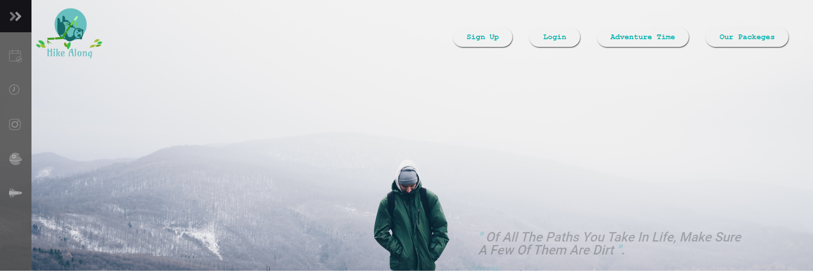

# SMACSS and Responsive Web Design
#### how to build websites suitable for all users.?
Responsive web design is the practice of building a
website suitable to work on every
device and every screen size, no matter how large or small, mobile or desktop

#### Responsive vs. Adaptive
**Responsive** and **adaptive** web design are closely related, and often transposed as one in the same. **Responsive** generally means to react quickly and positively to any change, while **adaptive** means to be easily modified for a new purpose or situation ,**A combination of the two is ideal**, providing the perfect formula for functional websites
Currently the most popular technique lies within responsive web design, favoring design that dynamically adapts to different browser and device viewports

**Responsive** web design is broken down into three main components, including
- flexible layouts
- media queries
- flexible media
***Flexible grids are built using relative length units, most***
***commonly percentages or em units:***
1-	vw
Viewports width
2-	vh
Viewports height
3-	vmin
Minimum of the viewport’s height and width
4-	vmax
Maximum of the viewport’s height and width

**Flexible layouts** do not advocate the use of fixed measurement units, such as pixels or inches. Reason being, the viewport height and width continually change from device to device. Website layouts need to adapt to this change and fixed values have too many constraints. Fortunately, Ethan pointed out an easy formula to help identify the proportions of a flexible layout using **relative values**.

The formula is based around taking the target width of an element and dividing it by the width of it’s parent element. The result is the relative width of the target element.
## target ÷ context = result

section,
aside {
  margin: 1.858736059%; /*  10px ÷ 538px(***container width***) = .018587361 */
}
section {
  float: left;
  width: 63.197026%;    /* 340px ÷ 538px = .63197026 */   
}
aside {
  float: right;
  width: 29.3680297%;  /* 158px ÷ 538px = .293680297 */
}
.

For even more control within a **flexible layout**, you can also leverage the **min-width**, **max-width**, **min-height**, and **max-height** properties.
The flexible layout approach alone isn’t enough. At times the width of a browser viewport may be so small that even scaling the the layout proportionally will create columns that are too small to effectively display content ..
#### this event, media queries can be used to help build a better experience

## Media Queries
Media queries were built as an extension to media types commonly found when targeting and including styles. Media queries provide the ability to specify different styles for individual browser and device circumstances, the width of the viewport or device orientation for example. Being able to apply uniquely targeted styles opens up a world of opportunity and leverage to responsive web design.

#### Example :
@media all and (max-width: 1024px) {...}

**Logical operators** in **media queries** help build powerful expressions.
 There are three different logical operators available for use within media queries, including **and**, **not**, and **only**.
Using the **and** logical operator within a media query allows an extra condition to be added, The **not** logical operator negates the query

i use this method in my previous project with the navigation bar:
**This image veiw on the mobile device :**

____________________________________
**This image veiw on the Desktop :**

## floats help Responsive Web Design
Aside from the simple example of wrapping text around images, floats can be used to create entire web layouts.

